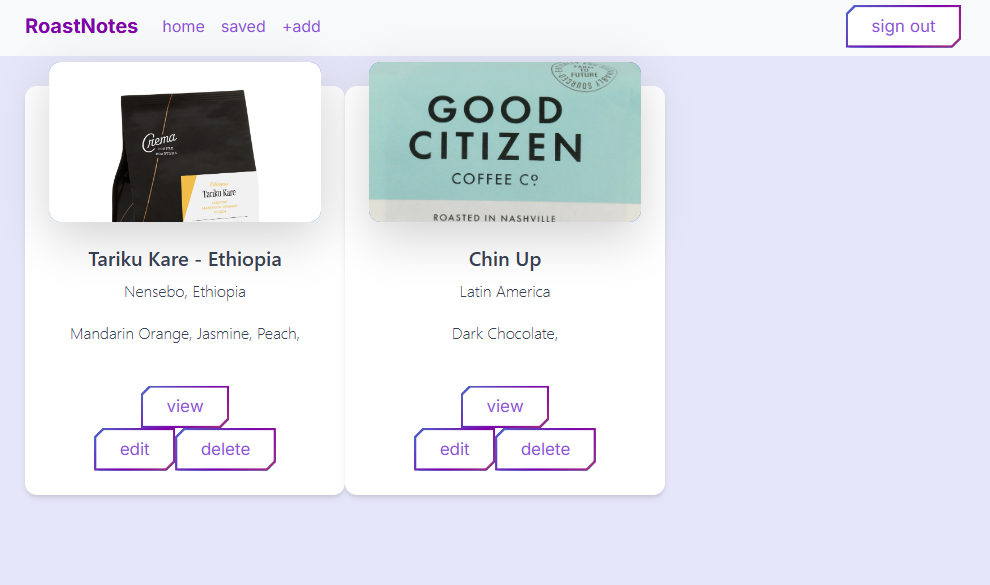

# RoastNotes 
[View Deployed App](https://roastnotes.netlify.app/)

## Overview
[Loom walkthrough](https://www.loom.com/share/d9df9dd5293a4723b3d29f96e29880f0?sid=49a28352-3cb1-4956-9ccc-d16e95a7dae1)

RoastNotes is an app for coffee lovers to log and share their favorite beans.

# User story

The ideal user for RoastNotes is someone who loves trying new coffees frequently for home brewing, but may have trouble remembering specific details of all the varieties and roasts they have used before and/or would like to try. 

## Features
- Users can add a new coffee to their list to save it and input all kinds of details like the bean's origin, where they bought it, tasting notes, and more
- Users can see all public entries on a homepage, meaning they can share with others
- Users can edit any entries they made, but not entries from other users
- Users can delete coffee entries

## Screenshots

## Links
-[Wireframe](https://www.figma.com/design/DSmhMQ5aX0J1GORhorAWkE/RoastNotes?node-id=0-1&t=f4pEbgItFkWBVUoi-1)
-[ERD](https://dbdiagram.io/d/RoastNotes-67b3f05a263d6cf9a07fd170)
-[Project Board](https://github.com/users/mikemcgee92/projects/3/views/1)

## Contributors
[Mike McGee](https://github.com/mikemcgee92)
